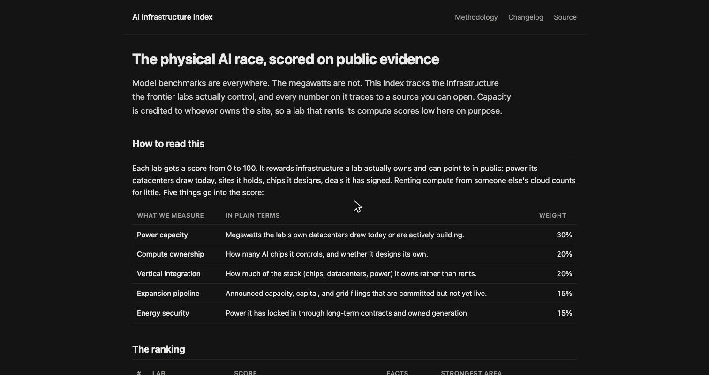

# AI Infrastructure Index

### ▶ Live dashboard: https://trivikrama-madhusudhana.github.io/ai-infra-index/

Open it and click any lab to see its score broken down to the individual facts, each one linked to
the public source it came from. No install, no code to run.

[](https://trivikrama-madhusudhana.github.io/ai-infra-index/)

Everyone benchmarks the models. Almost nobody tracks the megawatts. This is a scorecard of the
physical AI race, power capacity, datacenters, owned compute, and energy contracts, built so that
every number traces to a public source and the score is deterministic code you can rerun.

Two rules hold the whole thing up. Every fact carries the URL it came from, a verbatim excerpt,
and a computed source tier. And the score is a pure function of the ledger plus a versioned YAML
rubric, with no model and no network anywhere in the path.

## The parts that were actually hard

**Making the score reproduce byte for byte.** A scorecard nobody can reproduce is just an opinion
with a table. So `score.py` reads only the ledger and two YAML files, and it never touches the
clock, the network, or a random number. That last one matters more than it sounds: staleness
decay depends on how old a fact is, so "how old" has to be measured against a date you pass in
(`--as-of`), not against today. Pass the same date and you get the same bytes, which is what the
golden test in CI checks on every push. Output keys are sorted and floats are rounded at fixed
places, because "deterministic" fails on the first machine whose dict ordering differs.

**Tier is computed, never judged.** The single most tempting mistake in a project like this is to
let the thing that gathers a fact also decide how much to trust it. So the research agents never
assign a tier. Trust comes from a domain allowlist in `config/sources.yaml`: a source resolves to
Tier A, B, or C by suffix match on its host, and anything not on the list is Tier D and gets
rejected by the validator. When the baseline research surfaced 152 candidate facts, 16 came from
domains I will not score a ledger on (Wikipedia, an aggregator, a fan blog, an arxiv preprint).
They were dropped, each with its reason logged, and the other 136 went in.

**Append-only, so progress is a new fact, not an edit.** A datacenter that was announced last year
and is operational now is not a correction. It is two facts, and the old one points at the new one
through `superseded_by`. Nothing in the ledger is ever edited or deleted after it lands. That kept
the hardest domain error, conflating "announced" with "operational" capacity, from quietly
rewriting history, and it means the site can show a per-site status timeline for free.

**Owner-attribution, which produces an opinionated ranking.** Capacity is credited to whoever owns
the site. A lab that rents all its compute from a cloud scores low here on purpose, because renting
is not owning. That one decision is why OpenAI ranks below Meta despite the 500 billion dollar
Stargate program: Stargate is operated by Crusoe, Oracle, Vantage and SB Energy, so every megawatt
of it is a `cloud_partnership` fact rather than owned capacity. The same rule caught two Anthropic
facts that called a partner's chip "custom silicon"; reclassifying them moved Anthropic from 26.40
to 14.60.

## Reproducing the score

```bash
pip install pyyaml jsonschema
python scripts/score.py --as-of 2026-07-20   # rewrites index.json, byte-identical to the committed one
```

`--as-of` governs decay, so any past date is reproducible.

## Working on it

```bash
python scripts/validate.py                # schema + hygiene gate (CI runs this)
python scripts/gen_methodology.py         # regenerate METHODOLOGY.md from the rubric
python scripts/build_site.py              # regenerate the static site into docs/
python -m pytest tests/                   # golden determinism test
```

Facts enter through pull requests only, and `main` is never pushed to directly. `CONTRIBUTING.md` is the
binding rulebook for how a fact is added and verified. The 15-day update cycle (`/update-cycle`)
appends new facts and can run headless on a cron to open a PR unattended; a human still merges.

## Data layout

| Path | What it holds |
| --- | --- |
| `data/companies/*.json` | The evidence ledger, one file per lab, append-only |
| `config/sources.yaml` | Domain to tier allowlist; tier is computed from this, never judged |
| `config/scoring.v1.yaml` | The rubric: weights, bands, decay. Rendered verbatim to `METHODOLOGY.md` |
| `index.json` | Scoring output, committed and CI-checked for byte-identical reproduction |
| `schema/fact.schema.json` | Fact schema the validator enforces |
| `docs/` | Generated static site served by GitHub Pages, no framework, no build step |

## What it does not do

It does not estimate private data. Prices paid, PUE, and utilization are unknown for every lab,
score zero, and display as "Not publicly disclosed". Where estimation is unavoidable, like GPU
fleet sizes, it cites a third party (Epoch AI, SemiAnalysis) as the fact rather than guessing. And
it does not auto-merge: automation opens PRs, a human merges.

## License

MIT. Data facts are quotations from cited public sources, attributed to their publishers.
